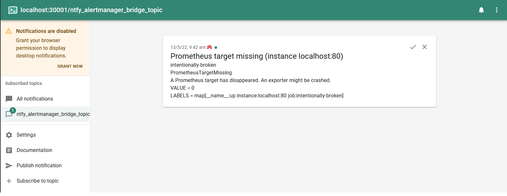

# ntfy alertmanager bridge

A basic alertmanager bridge to ntfy. Currently, you can pass a `jq` selector for the following fields:

- ntfy topic
- ntfy title
- ntfy priority
- // TODO: ntfy message

that receives the each individual prometheus [alert object](https://prometheus.io/docs/alerting/latest/notifications/#alert) in the [alertmanager webhook config](alertmanager/alertmanager/config.yml):

```sh
...
receivers:
  - name: "ntfy-servers"
    webhook_configs:
      - url: http://ntfy_alertmanager_bridge:30000/ntfy_alert?topic=.labels.topic&title=.annotations.summary&priority=.labels.priority|tonumber
        send_resolved: true
        max_alerts: 0
...
```

which will result in a notification like so:



The [docker-compose.yml](docker-compose.yml) contains a prometheus+alertmanager+ntfy+ntfy_alertmanager_bridge if you want to run the stack as is. Or if you want to pull just the ntfy_alertmanager_bridge simply add to your docker-compose.yml:

```sh
...

  ntfy_alertmanager_bridge:
    image: ghcr.io/atable/ntfy_alertmanager_bridge:main
    container_name: ntfy_alertmanager_bridge_from_registry
    ports:
      - 30000:30000
    environment:
      - NTFY_SERVER_ADDRESS=http://ntfy:80

...
```

Do note this is just a prototype, it works there has not been effort to make it production friendly. A sample payload of what alertmanager sends is [available here](documentation/sample-alert.json).

## Development

```sh
docker-compose up
```

Navigate to `http://localhost:30001/ntfy_alertmanager_bridge_topic`
